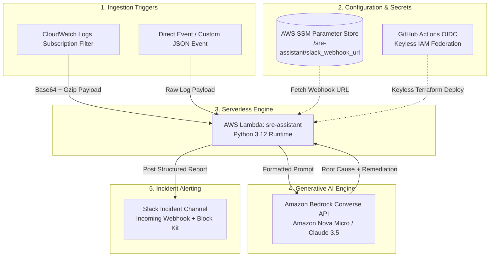

# 🚨 SRE Assistant - AI-Powered Incident Diagnostic Pipeline

[](https://aws.amazon.com/lambda/)
[](https://aws.amazon.com/bedrock/)
[](https://www.terraform.io/)
[](https://github.com/features/actions)
[](https://www.python.org/)

**SRE Assistant** is an automated AIOps incident diagnostic pipeline built on AWS. It ingests application runtime errors and CloudWatch log streams, analyzes root causes using **Amazon Bedrock Converse API**, generates copy-pasteable remediation commands, and posts rich visual reports directly to Slack.

---

## 🏗️ Architecture & Component Flow



### Pipeline Flow:
1. **Event Ingestion**: Receives Base64/Gzipped logs from CloudWatch Subscription Filters or raw JSON error events.
2. **Log Processing**: Decodes payload, extracts stack traces, and applies a 4,000-character safety truncation cap.
3. **Bedrock AI Reasoning**: Passes logs to Amazon Bedrock Converse API using low temperature (`0.1`) for deterministic analysis.
4. **Slack Alerting**: Constructs a formatted **Slack Block Kit** message with root cause, severity classification, and copy-pasteable AWS CLI remediation commands.

---

## ✨ Key Technical Features

* **Serverless & Lightweight**: Python 3.12 Lambda runtime using standard library `urllib` for webhooks (zero third-party dependencies in Lambda deployment zip).
* **Amazon Bedrock Converse API**: Uses structured system prompts for deterministic, reproducible SRE diagnoses.
* **Keyless CI/CD Security**: GitHub Actions authenticates to AWS via IAM OIDC federation—no long-lived AWS secret keys stored in GitHub Secrets.
* **Secret Isolation**: Webhook credentials stored out-of-band in AWS SSM Parameter Store (`/sre-assistant/slack_webhook_url`).
* **Automated Unit Testing**: Includes unit tests (`test_app.py`) integrated into the GitHub Actions CI pipeline.

---

## ⚡ Quickstart & Testing

### Prerequisites
* Python 3.12+
* AWS CLI configured with active credentials
* Slack Incoming Webhook URL

---

### 1. Local Testing (Fastest)

Clone the repository and run the test suite locally:

```bash
git clone https://github.com/Leospe24/sre-assistant.git
cd sre-assistant

# Create .env file with your Slack Webhook URL
cp .env.example .env

# Run local handler test
./test.sh local
```

---

### 2. Run Automated Unit Tests

```bash
python -m unittest test_app.py
```

---

### 3. AWS SSM Parameter Setup (One-Time Setup)

Store your Slack Webhook URL securely in AWS Parameter Store:

```bash
AWS_PROFILE=devops-admin aws ssm put-parameter \
  --name "/sre-assistant/slack_webhook_url" \
  --value "https://hooks.slack.com/services/YOUR/WEBHOOK/URL" \
  --type "String" \
  --overwrite \
  --region us-east-1
```

Verify your parameter exists in AWS:
```bash
./test.sh check-ssm
```

---

### 4. Deploy Infrastructure via Terraform

```bash
# Package Lambda payload
zip lambda_payload.zip app.py

# Initialize & Deploy Infrastructure
terraform init
terraform apply
```

---

### 5. Test Deployed AWS Lambda Function

Invoke the deployed Lambda function in AWS using a sample incident payload:

```bash
./test.sh cloud
```

---

## 📩 Sample Slack Incident Report Output

When SRE Assistant detects an error, it delivers a formatted Block Kit report to Slack:

> 🚨 **SRE Assistant Incident Diagnostic**
> 
> **Raw Log Payload:**
> ```text
> 2026-07-22 19:30:12 [ERROR] AWS_RDS_CONN_REFUSED: Failed to connect to PostgreSQL database at db.prod.internal:5432.
> psycopg2.OperationalError: fatal: password authentication failed for user "app_admin"
> ```
> 
> ---
> 
> **AI Diagnosis & Remediation Plan:**
> * **Root Cause**: Database authentication failure due to invalid credentials for user `app_admin`.
> * **Severity**: `HIGH`
> * **Remediation**:
>   ```bash
>   # Verify database credentials stored in Secrets Manager
>   aws secretsmanager get-secret-value --secret-id prod/rds/app_admin
>   ```
> 
> 🤖 *Powered by Amazon Bedrock Converse API | AWS AIOps Pipeline*

---

## 🛠️ Repository Structure

```text
.
├── app.py                  # Core Lambda handler, Bedrock client & Slack Block Kit formatter
├── test_app.py             # Unit test suite for log processing and truncation
├── test.sh                 # Unified test runner script (local, cloud, check-ssm)
├── test-event.json         # Sample SRE incident payload for manual testing
├── main.tf                 # Terraform Lambda & SSM data source definition
├── iam.tf                  # Lambda execution role & Bedrock IAM policies
├── github_oidc.tf          # Keyless GitHub Actions OIDC provider & IAM role
├── backend.tf              # Remote S3 state backend with DynamoDB locking
├── variables.tf            # Terraform variable definitions
└── .github/workflows/
    ├── deploy.yml          # Automated CI/CD plan & apply workflow
    └── destroy.yml         # Automated environment teardown workflow
```

---

## 📄 License
Distributed under the MIT License. See `LICENSE` for more information.
